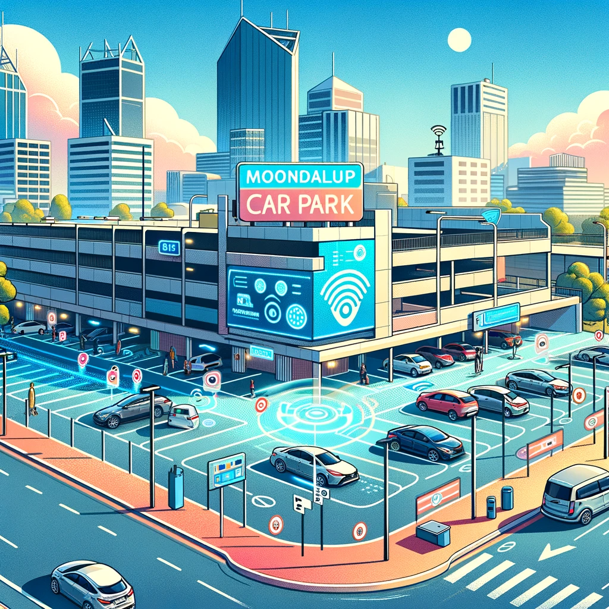

# MoonLander Car park system

Monitors vehicle entry and exit, and displays real-time parking availability.

Key Components:

 - Parking Bays
 - Sensor Network
 - Digital Display

## Documentation

| Class Name | Attributes                                    | Methods |
   |------------|-----------------------------------------------|---------|
| CarPark    | location, capacity, plates, sensor, displays  |         |
| Sensor     |                                               |         |
| Display    |                                               |         |

